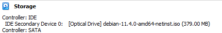
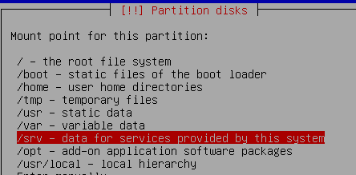
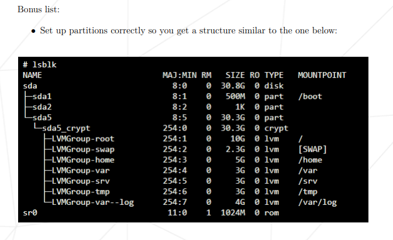

# 42 Born2beRoot

## Goals: 
Project aimed to learn more about system administration, and Linux OS
The main topics on this project covers:
 1. Booting VMs
 2. LVM partitions | Filesytem Hierarchy Standard 
 3. SSH services
 4. Firewall settings
 5. Sudo configuration
 5. User settings | Groups configuration | password policies
 6. CRON jobs

## 1. Setting Virtual Machine ISO and boot on VM
#### 1.1.Download Oracle Virtual Box 
- ISO of DebianOS: https://www.debian.org/download
- Oracle VM: https://www.oracle.com/br/virtualization/technologies/vm/downloads/virtualbox-downloads.html  
 
- Creating a new VM:
  - 2048MB RAM (The default is 1024MB, but if your computer has enough RAM you can dedicate more so it can be faster)
  - Set the HD to 30.8G (Implementing the Bonus, otherwise it would be set 8GB)
    - Storage on physical disk can be: 
       - Dynamically allocated 
         - Pros - it can grow in size
         - Cons - the pyshical disk can become highly fragmented, the performance may degrade
       - Fixed size 
         - Pros - it can be faster to run
         https://techgenix.com/fixedsizevs-dynamicallyexpandingvirtualharddisks/
  - Before booting
    - On disk -> Controller: IDE -> set Debian iso file  
    
    - On Network - set to "Bridged Adapter", so it can have internet access
    https://linuxhint.com/use-virtualbox-bridged-adapter/
 

#### 1.2. Boot setup
##### 1.2.1. Set hostname and domain name
- Difference between __host name__ and __domain name__ 
  - On the project required the hostname to be my login ending with 42
  - hostname is the computer name (human-readable format), and they can also serve as domain name.
  - domain name is the address used by users to access a website. One domain can have several hosts (machines) underneath.
  http://www.differencebetween.net/technology/difference-between-hostname-and-domain-name/
  - to change hostname: https://linuxhint.com/change-hostname-debian/

 

## 2. Partition Disk - understand LVM use, and File System Hierarchy

- __LVM__ (Logical Volume Managment) - There're tools that helps with managing how the pyshical disk space will be allocated like gparted. LVM creates a layer which gives the advantage and flexibility on how to split the memory from the pyshical disks (__Volume Groups__ - groups of __pyshical volumes__), and assign blocks of memory that will be treated as different mounts / partitions (__logical volumes__).
  - The advange by having this layer it enables to change the partitions currently in use (in many other tools it's necessary boot the OS from another disk, or format the disk in case you want to create new partition later. In VLM it doesn't have this limitation), and also one single partition can be made of several blocks of memory that doesn't need to be next to each other.
  - Biggest advantage of LVM is the ability to take __snapshots__ of the existing Logical Volume, having a backup of the state of the machine without shutting the system down. 
  - What's LVM: 
    - https://wiki.ubuntu.com/Lvm
  - How to use LVM:
    - https://access.redhat.com/documentation/pt-br/red_hat_enterprise_linux/6/html/logical_volume_manager_administration/index
    - https://www.howtogeek.com/howto/40702/how-to-manage-and-use-lvm-logical-volume-management-in-ubuntu/
    - https://www.redhat.com/sysadmin/lvm-vs-partitioning
  - How to use snapshots in VM VirtualBox:
    - https://docs.oracle.com/en/virtualization/virtualbox/6.0/user/snapshots.html
  - Other tools for using snapshots:
    - https://github.com/linuxmint/timeshift
 
- __Linux Filesytem Hierarchy Standard__
  - Common partitions when setting Linux

    - Linux File System/Structure Explained! - https://www.youtube.com/watch?v=HbgzrKJvDRw&
  - Swap partition - Free RAM memory when real RAM is full and more space is needed, by putting memory that wasn't used recently in disk.
    - https://www.wikiwand.com/en/Swap_partition
    - https://opensource.com/article/18/9/swap-space-linux-systems
 
- __`lsblk`__ - Linux command to display information about disk devices in a system.
   - https://linuxhint.com/linux-lsblk-command-tutorial-for-beginners/
   - what is the MAJ:MIN column - https://www.oreilly.com/library/view/linux-device-drivers/0596000081/ch03s02.html 
 
- Miscelaneous information:
  - Difference between Primary and Logical Partition
    - It's more a legacy from how old OS were set (Mainly DOS and Windows) where it could have only 4 partitions to load an operational system. Where on Linux it's possible to have multiple partitions one for each File system (reducing potential data loss)
       - sda 1 to 4 it could be considered primary partitions, and sda 5 and higher on are extended partitions. 
      - https://www.wikiwand.com/en/Disk_partitioning
      - https://askubuntu.com/a/1207738
  - Difference creating the disk at beggining or end of avaiable space - Didn't find any explanation on where it could be better to create at the end, but emperical tests suggests it might have a poor performance on the disk. 
    - https://askubuntu.com/questions/56883/is-having-the-swap-partition-at-the-beginning-better-than-at-the-end
  - Difference on ext4, ext3 and ext2:
    - types of filesystems created for Linux.
    - ext3 and ext4 enables journaling (able to log changes in the  machine)
    - https://www.learnitguide.net/2016/08/difference-between-ext2-ext3-and-ext4.html
 
- __Expected result__ -  After the manual setup the inital configuration of the VM, the hard disk should have the following structure [tip - take a snapshot of the state of the machine, or a copy of the VM to not need to go over this step again in case you end up doing something that doesn't how to fix or think in restarting the VM]

 

## 3. Setting SSH (Secure Socket Shell)
 - It's a network protocol that enables a secure way to access a machine over an unsecured network. It works by providing a strong password, and public key authentication method, creating encrypted data communication on an open network.
 https://www.techtarget.com/searchsecurity/definition/Secure-Shell
 - As part of the project. Set config file `/etc/ssh/sshd_config` to:
   - Enable port 4242 (Disable port 22 - default port on installation)
   - Prohibit root login as authentication method

 - After restarting the SSH check if the port 4242 is the only one in use. Otherwise map your network interface, ip adress, netmask and gateway, to change to static ip. At least on my case it was being cause by having DHCP enabled on default, and the solution was setting a static ip to that port 
  - https://www.efficientip.com/what-is-dhcp-and-why-is-it-important/
  - https://brunopontes.com.br/ensino/semestres/2018.1/soredes/guia_pratico_configuracao_rede_debian
  - This link is has many a lot of information on how to deal with SSH in Linux https://www.cyberciti.biz/tips/linux-unix-bsd-openssh-server-best-practices.html

 

## 4. Setting Firewall
  - Installing UFW (Uncomplicated Firewall), it works as a firewall manager. Monitoring the information and data traffic of the machine and connected networks
  - As part of the project it should allow connection only through port 4242.
    - sources:
      - https://wiki.debian.org/Uncomplicated%20Firewall%20%28ufw%29
      - https://www.vultr.com/docs/how-to-configure-uncomplicated-firewall-ufw-on-ubuntu-20-04/
  - On `systemctl` it should be normal to have the status active(exited) - the program run when machine booted and have the presets saved then the system exit the ufw. So in case any changes are done in the ufw settings to have it apply to the machine it would require to boot or run again in the system.
    - https://www.linuxquestions.org/questions/linux-security-4/difference-between-ufw-status-vs-systemctl-status-ufw-4175707244/
 

## 5. sudo
- Sudo is a program to allow a sysadmin to give limited access to users and log root activity. 
- Till now all the project was using the __root__ user, after this setup is possible to assign an user to sudo group can, and run commands by using the prefix `sudo`, and it's possible to finish the configuration of a machine in a remote local.
 
- https://www.sudo.ws/about/intro/
- https://man7.org/linux/man-pages/man8/sudo.8.html
 
- __Configure policies:__ 
  - Create `/var/log/sudo` folder to keep sudo log when enabling on the policies
  - To set sudo policies and following best practices. Instead of editing the /etc/sudoers. The local changes were in the `/etc/sudoers/.d` using visudo (it checks for any misspelling before saving)
  - the path `/etc/sudoers/.d` is already included in the `/etc/sudoers` as default
  - requiretty means it can only runs sudo commands on logged-in terminal session.
    - https://stackoverflow.com/a/68008345/16518944
  - secure_path - meant to resctrict which paths and in which order when running a executable with sudo    
    - https://askubuntu.com/a/924048
   
  - https://linux.die.net/man/5/sudoers

## 6. User settings

### 6.1. Creating new groups and assign users 
 - List all users in machine `cat /etc/passwd`
   - the columns are
     - User name
     - Encrypted password (x means the password is stored in the /etc/shadow file)
     - User ID number
     - User's group ID number
     - Full Name 
     - user home directory
     - Login shell
  - I didn't understand if the users needs to have the primary group as  user42, but this is how it's possible to change without messing up https://www.smarthomebeginner.com/safely-change-primary-group-group-in-linux

 

 - List all groups in machine `cat /etc/groups`
    - columns are 
      - group name
      - password
      - group id (gid)
      - group list 
 

 - To manage users - 
   - https://www.cyberciti.biz/faq/create-a-user-account-on-ubuntu-linux/
 - To manage groups - 
   - To mange users within groups - https://linux.die.net/man/1/gpasswd
   - To create groups - https://linux.die.net/man/8/groupadd

 

### 6.2. Password policies

#### 6.2.1. Time related settings
   - To apply these rules we use the command `chage` for existing users  and editing `/etc/login.defs` to apply for new users.
     • Your password has to expire every 30 days.
     • The minimum number of days allowed before the modification of a password will
be set to 2.
     • The user has to receive a warning message 7 days before their password expires.

 

#### 6.2.2. Password Strengh
    - It should follow these policies. For this I optted to use 
      - Your password must be at least 10 characters long. It must contain an uppercase letter, a lowercase letter, and a number. Also, it must not contain more than 3 consecutive identical characters.
      - The password must not include the name of the user.
      - The password must have at least 7 characters that are not part of the former password.

    
## 7. Monitor / CRON jobs

### 7.1. __Creating shell script that will need to run every 10 minutes__
    It should have these following information
      - The architecture of your operating system and its kernel version.
        - https://www.technologyuk.net/computing/computer-software/operating-systems/operating-system-architecture.shtml
      - The number of physical processors.
      - The number of virtual processors.
      - The current available RAM on your server and its utilization rate as a percentage.
      - The current available memory on your server and its utilization rate as a percentage.
      - The current utilization rate of your processors as a percentage.
      - The date and time of the last reboot.
      - Whether LVM is active or not.
      - The number of active connections.
      - The number of users using the server.
      - The IPv4 address of your server and its MAC (Media Access Control) address.
      - The number of commands executed with the sudo program.
    All the commands for this are on monitoring.sh file
    For displaying the information `wall` was used, it works as broadcast system to all users logged in the server.
### 7.2. __Manage with `crontab`__
    - Variables on cron
       add cron-variables.PNG
    - To manage cron service:
        - sudo systemctl enable cron.service
        - sudo systemctl start cron.service
        - sudo systemctl stop cron.service
        - sudo systemctl restart cron.service
        - sudo systemctl status cron.service
    - https://www.cyberciti.biz/faq/linux-execute-cron-job-after-system-reboot/
    - https://linux.die.net/man/5/crontab
  
  - to make sure its executable - rembember `chmod`
  https://fideloper.com/user-group-permissions-chmod-apache
 

## 8. BONUS - Setting wordpress

 - Wordpress is a open source system for Content Management System (CMS). Enabling a person to create a website without getting too deep in all the technical stuff
    ### 8.1. Setting lighttpd 
    - Lighttpd is an open source web server. 
    - Basicaly a web server is responsible to manage all the HTTP requests from a client to a server.
      - https://www.techtarget.com/whatis/definition/Web-server
    - Installing lighttpd - https://www.how2shout.com/linux/how-to-install-lighttpd-web-server-on-debian-11-bullseye-or-ubuntu-20-04/
    - configs are on `sudo vim /etc/lighttpd/lighttpd.conf`
    
    ### 8.2. Setting MariaDB
    - MariaBD is an open source Database.
    - At least necessary to make the initial setup, create a admin user and a database where wordpress will be kept
    - https://geekrewind.com/install-wordpress-on-ubuntu-16-04-lts-with-lighttpd-mariadb-and-php-7-1-support/
     
    ### 8.3. Setting PHP
    - https://tecadmin.net/how-to-install-php-on-debian-11/
    - Several addittional steps was necessary to install php
      - add sury as a safe site to download files (gnupg)
      - install wget. It's similar to curl where it enables to download files 
      - Also apt-key is deprecated, but on the tutorial I followed still uses. Later  I found the recommend way would be to use this, but I didn't tested
       `wget -qO- https://packages.sury.org/php/apt.gpg | sudo tee /etc/apt/trusted.gpg.d/sury.gpg`
    - Also additional packages may be necessary to run wordpress more smoothly -https://make.wordpress.org/hosting/handbook/server-environment/

    ### 8.4. Wordpress

    https://www.inmotionhosting.com/support/edu/wordpress/install-wordpress-debian-10/

    - After donwloading wordpress files 
    - Next step is to configure the
      - https://wordpress.org/support/article/how-to-install-wordpress/#step-3-set-up-wp-config-php
      - very detailed explanation of this file - https://developer.wordpress.org/apis/wp-config-php/

    ### 8.5. Setting FTP 

    - link - How to install wordpress using lighttpd
    https://www.atlantic.net/dedicated-server-hosting/how-to-install-wordpress-with-lighttpd-web-server-on-ubuntu-20-04/
  -  https://geekrewind.com/install-wordpress-on-ubuntu-16-04-lts-with-lighttpd-mariadb-and-php-7-1-support/
 

## 9. Miscelanous information learned throught the project
### 9.1. Difference between Linux distros (Debian vc CentOS)
 - Debian is a open source
 - CentOS is managed by 
### 9.2. Difference between _aptitude_ and _apt_
 - __apt-get__ is a lower level package management
 - __apt__ launched by Debian in ~2014 it's a higher level management package, which also takes in account apt-cache. 
 - __aptitude__ is a higher level managament package and has a graphical interface as well, and also handles functionatities of apt-mark and apt-cache. And also deal with dependencies better thant apt-get.
 
  - https://www.tecmint.com/difference-between-apt-and-aptitude/
  - Basic intro on apt- https://www.tecmint.com/useful-basic-commands-of-apt-get-and-apt-cache-for-package-management/

### 9.3. Difference between _SELinux_ and _AppArmor_
  - AppArmor is a Mandatory Access Control(MAC) sytem which is a kernel Linux Security Model (LSM), limitating what each program can do or consume resources. 
  - Differences - AppArmor is a bit more simple than SElinux, such as not being possible to have a Multi-Level-Security (MLS) and Multi-Category-Security (MCS), not being possible to keep separation between containers.
  - https://wiki.ubuntu.com/AppArmor
  - https://www.redhat.com/sysadmin/apparmor-selinux-isolation

### 9.4 What is TCP, UDP and sockets
 - https://medium.com/fantageek/understanding-socket-and-port-in-tcp-2213dc2e9b0c
 - https://stackoverflow.com/a/152863/16518944

 - https://sectigostore.com/blog/tcp-vs-udp-whats-the-difference/#:~:text=UDP%20(User%20Datagram%20Protocol),sometimes%20called%20packets%20as%20well).

### 9.5 What is tty (Teletypewirter)
 - Basically it ensures it's a kernel where the inputs are done by a person
 - https://itsfoss.com/what-is-tty-in-linux/
### Coding editor on command line
 - Since on this project all setup needs to be done on command line. I opted for vim as text editor
- Ubuntu already comes with vi already installed, but doesn't have many features that has on vim. (highlight text colors!)
 - Cheatsheet - https://vimsheet.com/
### - Sources - 

Extra material

Course - for linux 
https://www.redhat.com/en/services/training/rh024-red-hat-linux-technical-overview?section=Outline

Top 10 Linux Job Interview Questions
https://www.youtube.com/watch?v=l0QGLMwR-lY

Debian handbook -
https://debian-handbook.info/browse/stable/

